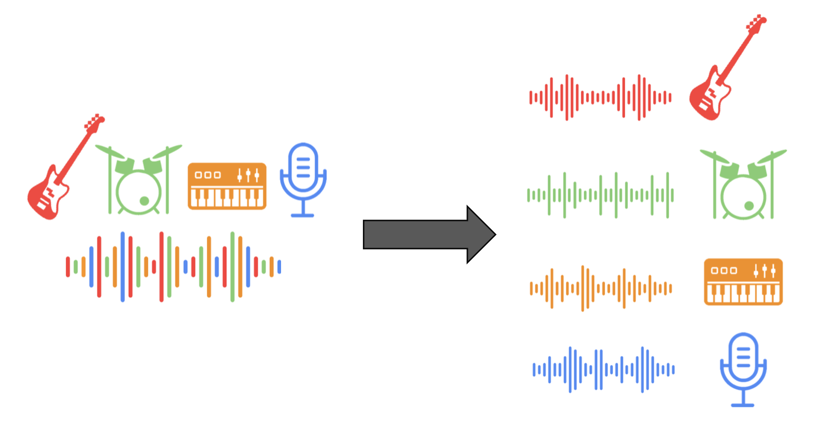
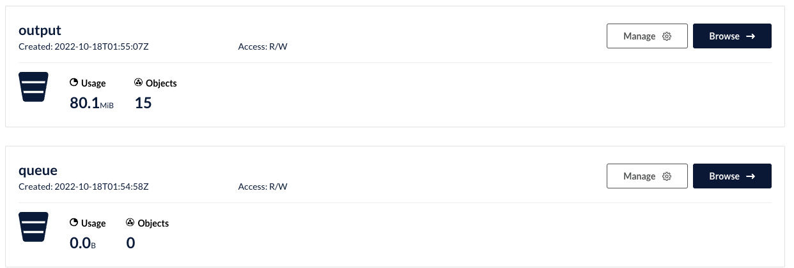
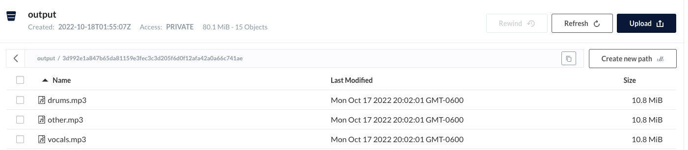

[](https://classroom.github.com/online_ide?assignment_repo_id=9095953&assignment_repo_type=AssignmentRepo)
# lab7-music-separation-kubernetes

Music-Separation-as-a-service (MSaaS)
## Overview
In this lab, you're going to create a kubernetes cluster that provides a REST API for automatic music separation service and prepares the different tracks for retrieval. You can, if you wish, provide an alternate gRPC API following the genera outline of this lab.

You may [want to bookmark this kubernetes "cheat sheet"](https://kubernetes.io/docs/reference/kubectl/cheatsheet/).

You should complete the QwikLabs tutorials on using Docker and Kubernetes and go through [the csci 4253/5253 Kubernetes tutorial](https://github.com/cu-csci-4253-datacenter/kubernetes-tutorial) prior to starting this homework. That tutorial (and the QwikLab tutorials) shows you how to construct a simple Dockerfile, build a Docker image, push it to the Docker Hub or Google registry and then deploy it on Kubernetes. You can either use the Google cloud shell to do your work or install Docker and Kubernetes on your laptop.

You will deploy containers providing the following services.
+ **rest** - the REST frontend will accept API requests for analysis and handle queries concerning MP3's. The REST worker will queue tasks to workers using `redis` queues. Full details are provided in [rest/README.md](rest/README.md).
+ **worker** - Worker nodes will receive work requests to analyze MP3's and cache results in a cloud object store (probably Min.io). Full details are provided in [worker/README.md](worker/README.md).
+ **redis** - You will be provided a Redis deployment and service to provide a redis database server. Full details are provided in [redis/README.md](redis/README.md.)

### Waveform Source Separation Analysis
The worker will use [open source waveform source separation analysis](https://github.com/facebookresearch/demucs) software from Facebook. See the [worker README](worker/README.md) for more details. Our reason for turning this into a micro-service is because it takes a long time to run the source separation (about 3-4x the running time of a song).

### Setting up Kubernetes
You will need to create a Kubernetes cluster to run your code. You can either use a local install of Docker and Kubernetes or use Google Cloud's service, GKE. You **should a local setup for development** and then switch to GKE at the end.

See the [directions in the Kubernetes tutorial on deploying a GKE cluster](https://github.com/cu-csci-4253-datacenter/kubernetes-tutorial/tree/master/07-guestbook-on-gke).

### Cloud object service

Rather than send the large MP3 files through Redis, I suggest using the Min.io object storage system (or other object store) to store the song contents ***and*** the output of the waveform separation. 
We suggest you use the [min.io python interface](https://min.io/docs/minio/linux/developers/python/API.html) to connect to an object storage system like [Min.io](https://github.com/cu-csci-4253-datacenter/kubernetes-tutorial/tree/master/06-minio), [Google object store](https://cloud.google.com/storage) and Amazon S3.
The library [has several example code snippets](https://github.com/minio/minio-py/tree/release/examples) that you can repurpose.

One benefit of an object store is that you can control access to those objects & direct the user to download the objects directly from *e.g.* S3 rather than relaying the data through your service. We're not going to rely on that feature.

We strongly suggest you set up a [Min.io server as shown in the Kubernetes tutorial](https://github.com/cu-csci-4253-datacenter/kubernetes-tutorial/tree/master/06-minio) and use that during your development phase. You could then change the credentials and endpoint if you want to e.g. use Google Object Store later.

In my reference solution, I had a single 'bucket' called "queue" that holds the objects containing MP3 songs to process and another bucket called "output" to hold the results ready for download:


The "output" bucket has objects named `<songhash>-<track>.mp3` that contain the separate tracks of a song:


## Suggested Development Steps

First, ***it's important to understand that the DEMUCS application consumes a lot of memory***. You should test with the short data samples and only use a single Worker node at first. You can check the node resources using `kubectl get nodes` to list the nodes and *e.g.* `kubectl describe node <nodename>` to see how much memory and cpu is available.using `describe` will also alert you to pods being killed due to lack of memory. 

You should first deploy the `redis` provided deployments. We've provided a script `deploy-local-dev.sh` that does this and enables *port forwarding* from the corresponding services to your local host, simplifying development of your rest and worker program.

Unlike previous labs, we've dropped the use of `rabbitmq` because it has some un-needed complexities. Instead, we suggest you use [Redis list data-types](https://redis.io/docs/data-types/lists/) to provide events to the worker. This can be done using [`lpush`](https://redis.io/docs/data-types/lists/#basic-commands) to add work to the queue and [`blpop` blocking pop](https://redis.io/docs/data-types/lists/#blocking-commands) to wait for work and remove it for processing.

Although not explicitly required in production, we have provided [a simple python program `logs/log.py`](logs/logs.py) that connects to the `logging` key in database 0 of Redis using the `lpush`/`blpop` model. You can use that to subscribe to any informational or debug messages to understand what's going on. It's useful to deploy that service as a "logs" pod (or deployment) so you can monitor the output using `kubectl logs logs-<unique id for pod>`. With port-forwarding enabled you should also be able to run it locally. If you've deployed a GKE cluster, you may also want to use the GKE logs and reporting mechanism.

Following that, you should construct the `rest` server because you can use that to test your `redis` database connection and your debugging interface. Lastly, start on the `worker`. We recommend that you develop your worker on your laptop because that reduces the number of times you need to build and push containers; to do this, you would port-forward the redis connection to your laptop and your worker would then connect to the appropriate ports on `localhost` (see below).

When you deploy things in Kubernetes, you should use version numbers for your container images. If you're in a edit/deploy/debug cycle, your normal process to deploy new code will be to push a new container image and then delete the existing pod (rest or worker). At that point, the deployment will create a new pod. If you're using version numbers, you'll be able to insure that you're running the most recent code. You can also use the `latest` tag, but if it looks like things are not using the right version, switch to version numbers.

Each subdirectory contains directions in the appropriate README file.

### Port Forwarding

While you're developing your rest and worker programs, you may want to do development on your local computer while still using the `minio` and `redis` nodes in your Kubernetes cluster. You can do this using `kubectl port-forward` for specific services which will connect a Kubernetes service to you local system (whether it's in Google's GKE or your local system). You can to that using e.g.
```
kubectl port-forward --address 0.0.0.0 service/redis 6379:6379 &
kubectl port-forward --namespace minio-ns svc/myminio-proj 9000:9000 &
```
to forward your Redis database to port 6379 on your computer and minio to local port 9000 on your computer. Then, your rest server & worker can connect to e.g. `localhost:6379` or `localhost:9000` while you test your code. The script `deploy-local-dev.sh` both deploys `redis` and then sets up port-forwarding for you for `redis` and `minio`.

### Sample Data
We've produced two programs `sample-requests.py` and `short-sample-requests.py` that make some sample requests.

Processing an MP3 file takes a while - they also take a fair amount of memory (at least 6GB in my experience). You're encouraged to use the `short-sample-requests.py` examples on your laptop and then try the longer samples when using GKE.
